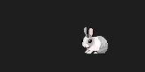

# CSharp桌面宠物-小兔子

采用C#透明窗体并使用label播放gif动画所实现的桌面宠物的效果。

## 功能

点击会让小兔子跑起来，右键退出软件

## 依赖

需要安装.NET6.0运行库,下载地址:[x64](https://dotnet.microsoft.com/zh-cn/download/dotnet/thank-you/runtime-desktop-6.0.13-windows-x64-installer) [x86](https://dotnet.microsoft.com/zh-cn/download/dotnet/thank-you/runtime-desktop-6.0.13-windows-x86-installer)  

## 鸣谢

本项目大量参考以下项目

> [mian2018/CSharp_TransparentForm](https://github.com/mian2018/CSharp_TransparentForm)

